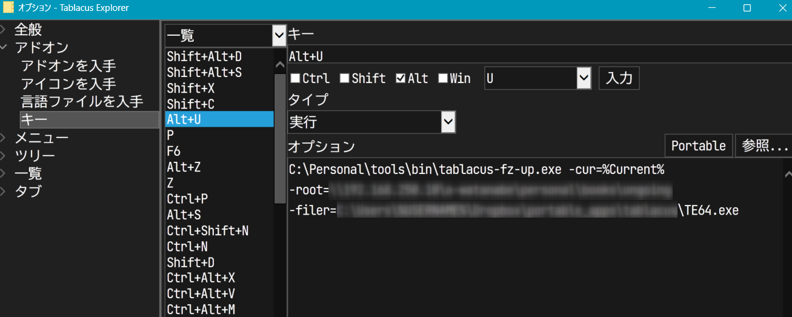

# README

Command line tool for [Tablacus Explorer](https://tablacus.github.io/explorer.html).

- List up all relative paths to the `-root` and select with fuzzy-finder.
- Open selected directory on new tab.

